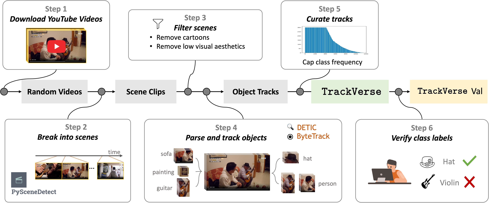

# TrackVerse: A Large-scale Dataset of Object Tracks
TrackVerse is the largest video dataset that ensures object-centricity, class diversity and rich object motions and states to date, offering a unique playground to explore unsupervised representation learning from object dynamics, moving beyond static object appearance. 
It is built using an automated collection pipeline, shown below, and can be easily scaled up without any manual annotation.

  

TrackVerse also provides a validation subset with human-verified labels for the object categories to facilitate in-domain evaluation of object representation learning methods. 

In this repo, we provide an overview of the TrackVerse dataset, and the code to use it, extend it, or generate a customized dataset using our pipeline.

## Table of Content
- [TrackVerse Overview](#trackverse-overview)
- [Quickstart](#quickstart)
- [Download TrackVerse](#download-trackverse)
- [Generate Customized TrackVerse Dataset](#generate-customized-trackverse-dataset)
- [Maintenance](#maintenance)
- [License](#license)

## TrackVerse Overview
The Full TrackVerse contains 4,100,000 object tracks, spanning 1203 categories from the [LVIS](https://www.lvisdataset.org) ontology 
with a long-tailed distribution. 
The objects are localized using [DETIC](https://github.com/facebookresearch/Detic) and tracked over time using 
[ByteTrack](https://github.com/ifzhang/ByteTrack). See detailed analysis in [here](./doc/statistics.md).

We also offer curated subsets at different scales, ensuring more balanced class distributions. 
These subsets limit the number of tracks per class to 100, 300, 500, and 1000, resulting in four carefully selected 
subsets containing 82,000, 184,000, 259,000, and 392,000 tracks, respectively.

## Quickstart
Get started with TrackVerse by setting up your environment and exploring the dataset through a demonstration.
1) **Set Up the Environment:** Refer to the [install guidelines](doc/env.md) for detailed instructions.
2) **Clone the Repository:** `git clone --recurse-submodules https://github.com/MMPLab/TrackVerse.git`
3) **Demo:** The [dataset_demo.ipynb](dataset_demo.ipynb) notebook guides you through the process of downloading and accessing TrackVerse from the provided JSONL file and the process of using the pipeline to extract object tracks.

## Download TrackVerse
The dataset is released as a list of YouTube video IDs together with the metadata for all object tracks extracted from them. The dataset is organized in JSONL files, with each line containing the metadata for a single object track. TrackVerse is available for download in the following subsets:

| Subset        | #Tracks |Max Tracks per Class |Link |
|---|---|---|---|
|Full TrackVerse|4.1M|---|[Google Drive](https://drive.google.com/file/d/14xCEq-UEQAZaFQj7-fGNqEnOd26AZtYx/view?usp=drive_link)|
|82K-CB100 |82K|100|[Google Drive](https://drive.google.com/file/d/181WNhqewLnj-Ais3rL7cYoIwzowbUob4/view?usp=drive_link)|
|184K-CB300 |184K|300|[Google Drive](https://drive.google.com/file/d/1410JsoHwsY8eiFvpfWk8M0yYFh7EC62I/view?usp=drive_link)|
|259K-CB500 |259K|500|[Google Drive](https://drive.google.com/file/d/16jM3_IoSD59k33LfhDm87r0oip7W3ZNw/view?usp=drive_link)|
|392K-CB1000 |392K|1000|[Google Drive](https://drive.google.com/file/d/1qT2HvJumzdcNqMapP8SJZ18j9D1ABDwj/view?usp=drive_link)|

 
Metadata keys

Below is a detailed explanation of the keys present in each line of these JSONL files:

- `track_id` - unique track identifier.
- `video_size` - [height, width] of the video from which this track was extracted.
- `track_ts` - [start_time, end_time] timestamps (seconds) in the original video for the first and last frame in the track.
- `top10_lbl` - Class IDs of the top-10 predicted classes for the track, based on class logit score.
- `top10_desc` - Names of the top-10 predicted classes for the track, based on class logit score.
- `top10_cls` - [[top-10 logits mean], [top-10 logits std]] A list of the mean values of the classification logits for the top 10 classes, and a list of the standard deviations for these logits.
- `top10_wcls` - [[top-10 weighted logits mean], [top-10 weighted logits std]] A list of the mean scores for each of the top 10 weighted scores (class logits weighted by the objectness score), and a list of the standard deviations of these scores.
- `frame_ts` - timestamps (seconds) in the original video for each frame in the track
- `frame_bboxes` - list of bounding box coordinates [top_left_x, top_left_y, bottom_right_x, bottom_right_y] of the object for each frame in the track.
- `yid` - YouTube ID for the video from which this track was extracted
- `mp4_filename` - Filename of the track produced by running the track extraction pipeline.

To extract TrackVerse from the JSONL file, follow the [download](doc/download.md) instruction.

## Generate Customized TrackVerse Dataset
You can also create your own customized dataset of object tracks, for example, using different vocabulary, different source videos or different curation strategies.

1) **Set Up the Environment:** Refer to the [install guidelines](doc/env.md) for detailed instructions.
2) **Clone the Repository:** `git clone --recurse-submodules https://github.com/MMPLab/TrackVerse.git`
3) **Follow the Pipeline:** Follow the detailed steps outlined in our [pipeline documentation](doc/pipeline.md).

## Maintenance
For support or inquiries, please open a [GitHub issue](https://github.com/MMPLab/TrackVerse/issues). If you have questions about technical details or need further assistance, feel free to reach out to us directly.

## License
All code and data in this repo are available under the [MIT License](LICENSE) for research purposes only.
